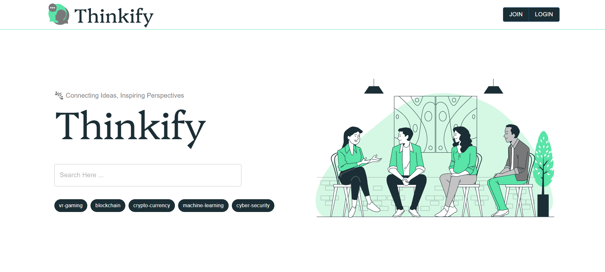

# Thinkify

A full-stack **MERN** application that provides a collaborative platform for users to share posts, manage tasks, and showcase products through a modern dashboard with secure authentication and role-based access control.

---

## Preview

<p align="center">
  
</p>

---

# Tech Stack

### Frontend

* React.js
* Vite
* React Router
* Tailwind CSS

### Backend

* Node.js
* Express.js
* MongoDB
* Mongoose
* JWT Authentication
* Bcrypt

---

# Features

## Authentication

* User Registration
* Secure Login
* JWT Authentication
* Role-Based Authorization
* Password Encryption

## User Dashboard

* User Profile
* Account Settings
* Change Password
* Sign Out

## Admin Dashboard

* User Management
* Role Distribution Analytics
* Monthly User Activity

## Posts

* Create Post
* View Posts
* Manage Personal Posts

## Marketplace

* Add Products
* Manage Products
* Product Listings

## Task Management

* Create Tasks
* Update Task Status
* Organize Daily Activities

---

# Project Structure

```
Thinkify
│
├── client
│   ├── components
│   ├── pages
│   ├── layouts
│   ├── routes
│   └── src
│
├── server
│   ├── config
│   ├── controller
│   ├── middleware
│   ├── models
│   ├── routes
│   └── uploads
│
└── README.md
```

---

# Getting Started

## Prerequisites

* Node.js
* MongoDB

---

# Installation

```bash
git clone https://github.com/ayushawa/Thinkify.git
```

### Backend

```bash
cd server
npm install
npx nodemon index.js
```

### Frontend

```bash
cd ../client
npm install
npm run dev
```

---

# Environment Variables

## Backend (.env)

```env
PORT=3000
DATABASE_URL=your_database_url
DATABASE_NAME=thinkify
JWT_SECRET_KEY=your_secret_key
COOKIE_KEY=thinkify
COOKIE_EXPIRES=5d
BCRYPT_GEN_SALT_NUMBER=10
UPLOAD_DIRECTORY=uploads
```

## Frontend (.env)

```env
VITE_SERVER_ENDPOINT=your_backend_api
VITE_TOKEN_KEY=thinkify
VITE_USER_ROLE=role
VITE_COOKIE_EXPIRES=1
```


---
